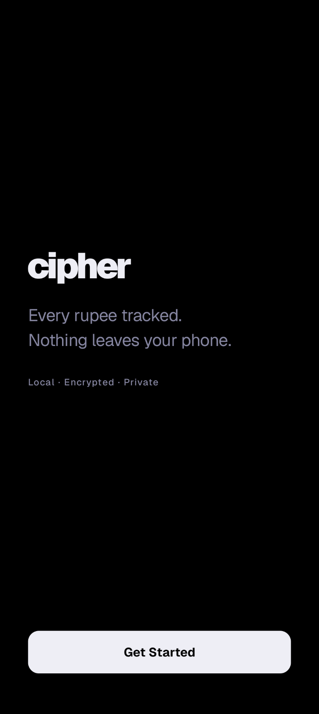
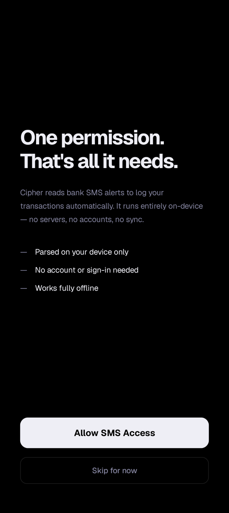
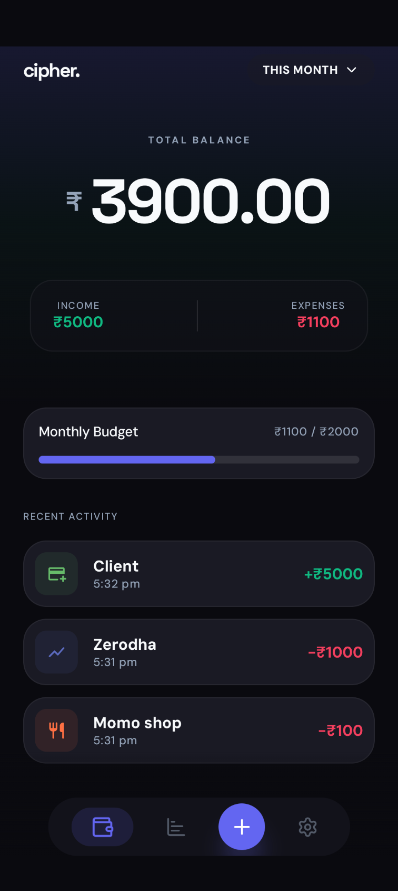
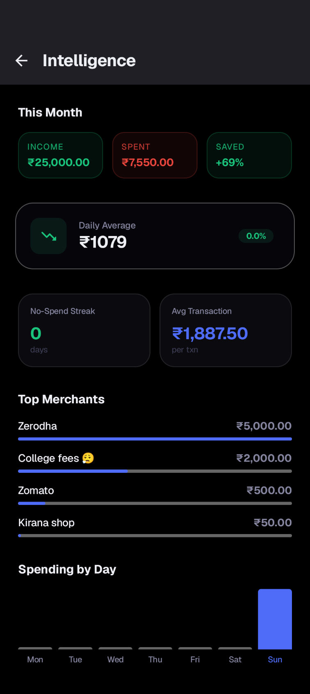
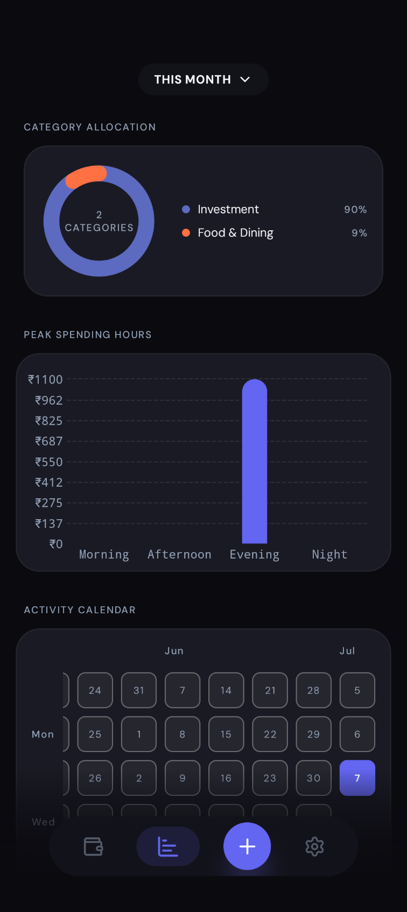
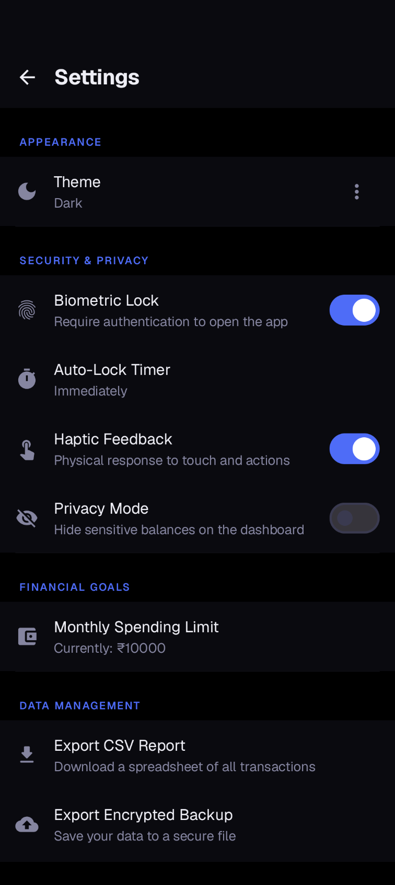
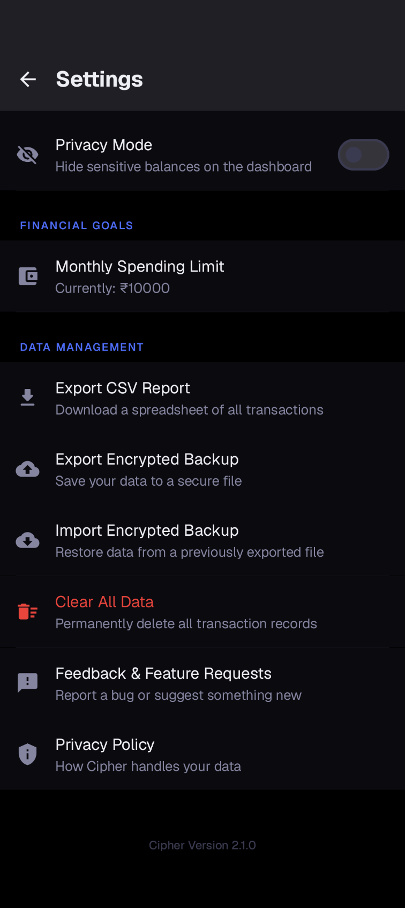
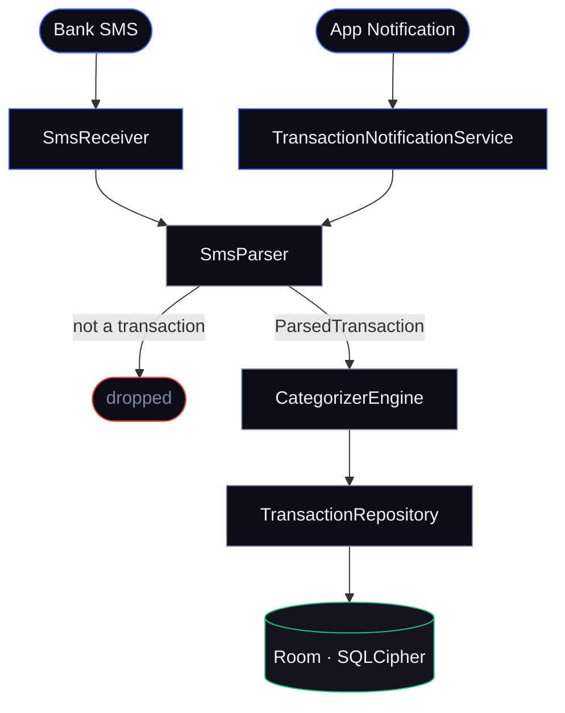
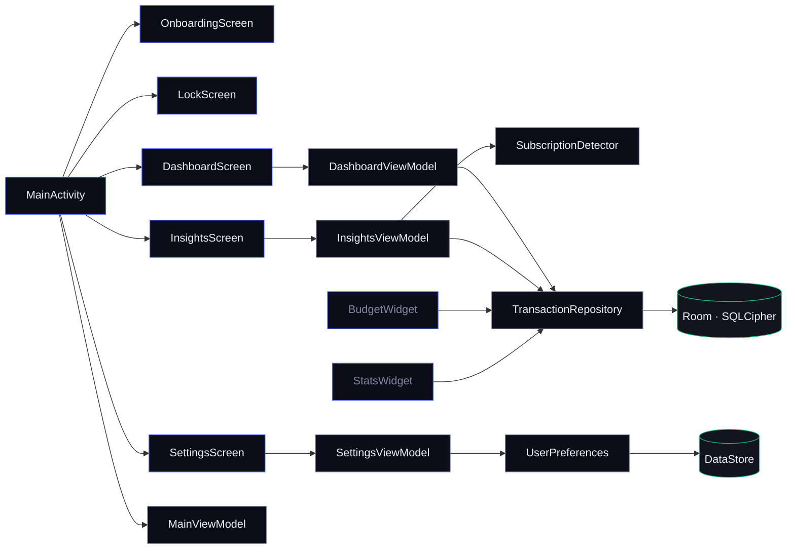

# cipher

A local-first, privacy-focused personal finance app for Android. cipher reads your bank SMS alerts and app notifications, turning them into a clean, searchable transaction ledger — entirely on-device, with zero cloud dependency.

---

## Screenshots

| Onboarding | Permission | Dashboard |
|:-----------:|:---------:|:---------:|
|  |  |  |

| Insights | Insights | Settings | Settings |
|:--------:|:--------:|:--------:|:--------:|
|  |  |  |  |

---

## How it works

```
Bank sends SMS alert           App sends Notification
        │                                │
        ▼                                ▼
  SmsReceiver                 TransactionNotificationService
        │  raw message body
        ▼
    SmsParser
   ┌────────────────────────────────┐
   │  1. Regex: amount + direction  │
   │  2. Brand dict: merchant name  │
   │  3. Currency extraction (INR)  │
   └────────────────────────────────┘
        │  ParsedTransaction
        ▼
  CategorizerEngine
   assigns category (Food, Travel, UPI…)
        │
        ▼
  TransactionRepository
        │  TransactionEntity
        ▼
  Room + SQLCipher (AES-256 encrypted DB)
        │
        ▼
  DashboardViewModel ──► UI (Jetpack Compose)
```

No network call is made at any point. The SMS or Notification is read, parsed, and written to the encrypted database — all within background scope for reliable execution.

---

## Architecture

cipher uses **MVI (Model-View-Intent)** across all screens, backed by Hilt DI.

Each screen follows the same contract pattern, now utilizing a dedicated UseCase layer:

```text
Screen.kt  ──intent──►  ViewModel  ──state──►  Screen.kt
                │                        ▲
                └──► UseCase ────────────┘
                        │
                        ▼
                    Repository
```

### Transaction pipeline



### App layers



---

## Features

### Automatic Transaction parsing
- **SMS Parsing**: Listens for `SMS_RECEIVED` broadcasts from bank sender IDs
- **Notification Parsing**: Uses `NotificationListenerService` to capture and parse transaction alerts from explicitly tracked finance/UPI apps
- Externalized Regex patterns and dictionaries via `SmsPatterns` for easier maintenance
- Detects promotional SMS and notifications and filters them out reliably
- India-focused brand dictionary covers major UPI, credit card, and bank alert formats
- False-positive filtering rejects OTPs, promotional, and non-transactional messages

### Dashboard
- Global Pill-shaped floating Navigation Bar
- Running balance with income/expense split and scrolling header layout
- Transaction timeline with spend-based sorting capabilities and weekly interval filtering
- Live search by merchant or category
- Add, edit, delete with snackbar undo
- Monthly budget ring with health color coding
- Privacy mode — blurs all amounts with one tap

### Insights
- High-performance spending velocity charts built on custom `Canvas` Compose
- Category breakdown doughnut
- Advanced scrollable Calendar heatmap with monthly paging
- Day-detail drill-down
- Subscription detector — finds recurring payments and predicted next billing dates

### Security
- **Database**: SQLCipher AES-256 full-disk encryption
- **Biometric lock**: Fingerprint / face auth via `BiometricPrompt`; configurable auto-lock timeout
- **First-run onboarding**: Welcome + SMS permission gate before dashboard is accessible
- **Privacy mode**: All monetary values blurred on-screen

### Home screen widgets
- **BudgetWidget** — monthly spend vs. budget at a glance
- **StatsWidget** — today's income and expense summary

### Data portability
- **CSV export** — standard format, opens in any spreadsheet app
- **PDF statement** — export elegant transaction history reports natively generated on-device
- **Encrypted backup / restore** — password-protected binary backup of the full database
- **Auto backup** — automated scheduled database backups to a local or synced folder

### Storage Footprint
Because cipher stores data in a local SQLite database, it is incredibly lightweight and infinitely scalable.
- **1 Transaction** = ~160 Bytes
- **1,000 Transactions** = ~160 KB
- **10,000 Transactions** = ~1.6 MB
You could log 5 transactions a day for over 5 years and the database would barely cross 1.5 megabytes.

---

## Data flow in detail

### SMS & Notification → Transaction

```
android.provider.Telephony.Sms.Intents.SMS_RECEIVED
    └─► SmsReceiver.onReceive()
            └─► SmsParser.parse(body: String): ParsedTransaction?

android.service.notification.NotificationListenerService
    └─► TransactionNotificationService.onNotificationPosted()
            └─► SmsParser.parse(body: String): ParsedTransaction?
                    ├── amount regex        (e.g. "Rs. 450.00", "INR 1,200")
                    ├── direction keywords  (debited/credited/spent/received)
                    ├── merchant extraction (brand dict → fallback heuristics)
                    └── returns null for non-transactional messages
            └─► CategorizerEngine.classify(merchant): TransactionCategory
            └─► TransactionRepository.insertTransaction(TransactionEntity)
                    └─► TransactionDao.insert() → SQLCipher Room DB
```

### App launch → visible UI

```
MainActivity.onCreate()
    └─► UserPreferences.settingsFlow (DataStore)
            ├── hasCompletedOnboarding?
            │       NO  → show OnboardingScreen (blocks all input below it)
            │       YES → continue
            ├── isBiometricEnabled + BiometricAuthenticator.available?
            │       YES → show LockScreen → BiometricPrompt
            │       NO  → isAuthenticated = true immediately
            └─► NavHost renders: dashboard / insights / day_detail / settings
```

### UserPreferences (DataStore)

| Key | Type | Default | Purpose |
|-----|------|---------|---------|
| `app_theme` | String | `SYSTEM` | Light / Dark / System |
| `biometric_enabled` | Boolean | `true` | Biometric lock on/off |
| `privacy_mode` | Boolean | `false` | Blur amounts |
| `haptics_enabled` | Boolean | `true` | Haptic feedback |
| `preferred_currency` | String | `INR` | Display currency |
| `auto_lock_timeout` | Long | `0` | ms before re-locking on resume |
| `last_stop_time` | Long | `0` | Used to compute lock grace period |
| `monthly_budget` | Double | `0.0` | Budget cap |
| `onboarding_completed` | Boolean | `false` | First-run gate |

---

## Module map

```
app/
└── src/main/java/com/masum/cipher/
    ├── MainActivity.kt               # Nav host, biometric gate, lifecycle lock
    ├── CipherSpendApp.kt             # Hilt application class
    │
    ├── core/
    │   ├── data/
    │   │   ├── local/
    │   │   │   ├── AppDatabase.kt    # Room + SQLCipher setup
    │   │   │   ├── dao/              # TransactionDao, MerchantAliasDao
    │   │   │   ├── entity/           # TransactionEntity, MerchantAliasEntity
    │   │   │   └── pref/             # UserPreferences, WidgetDataStore
    │   │   └── repository/           # TransactionRepository, BackupRepository
    │   ├── di/                       # Hilt modules (DatabaseModule)
    │   ├── domain/
    │   │   ├── CategorizerEngine.kt  # Merchant → category heuristics
    │   │   ├── SubscriptionDetector.kt
    │   │   └── model/                # ParsedTransaction, TransactionCategory
    │   ├── mvi/                      # MviBase (shared ViewModel base)
    │   ├── security/                 # BiometricAuthenticator, SecurityManager
    │   ├── sms/                      # SmsReceiver, SmsParser
    │   └── util/                     # Formatters
    │
    └── ui/
        ├── components/               # Shared composables, Charts, LockScreen
        ├── dashboard/                # DashboardScreen + ViewModel + Contract
        ├── insights/                 # InsightsScreen + DayDetailScreen + ViewModel
        ├── onboarding/               # OnboardingScreen (first-run)
        ├── privacy/                  # PrivacyPolicyScreen
        ├── settings/                 # SettingsScreen + ViewModel + Contract
        ├── theme/                    # Color, Typography, Theme
        └── widget/                   # BudgetWidget, StatsWidget + Receivers
```

---

## Tech stack

| Layer | Technology |
|-------|-----------|
| Language | Kotlin 2.4.10 |
| UI | Jetpack Compose + Material 3 |
| Architecture | MVI via `MviBase` |
| DI | Hilt |
| Database | Room 2.x + SQLCipher (AES-256) |
| Preferences | DataStore Preferences |
| Security | BiometricPrompt, androidx.security.crypto |
| Navigation | Navigation Compose |
| Widgets | Glance (AppWidget) |
| Min SDK | 24 (Android 7.0) |
| Target SDK | 37 (Android 17) |
| Version | 4.6.0 |

---

## Build

```bash
# Debug APK
./gradlew :app:assembleDebug

# Release APK (requires signing config)
./gradlew :app:assembleRelease
```

Open in Android Studio (Ladybug or newer). Compile SDK 35 required.

---

## Installing

Download the APK from the [Releases page](https://github.com/insaneodyssey26/Cipher/releases).

For step-by-step install instructions including the Android 13+ SMS permission setup, see **[INSTALL.md](INSTALL.md)**.

---

## Privacy

cipher requests exactly three permissions: `RECEIVE_SMS`, `BIND_NOTIFICATION_LISTENER_SERVICE` (optional, to read bank app alerts), and `POST_NOTIFICATIONS` (optional, for budget alerts). It has **no INTERNET permission**. There is no telemetry, no analytics SDK, no crash reporter, and no account system. All data — transactions, preferences, backups, and generated PDFs — stays natively on your device.

---

## Release history

See [RELEASE_NOTES.md](RELEASE_NOTES.md).
